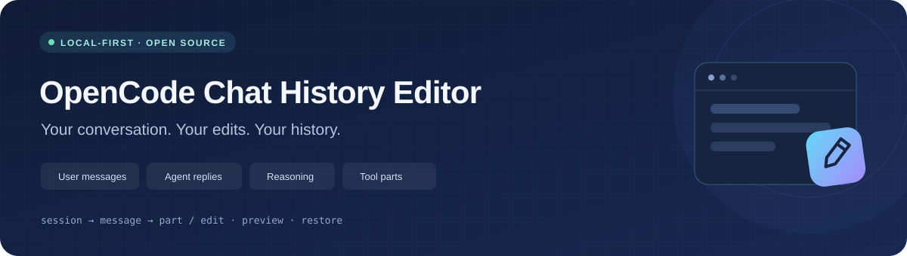
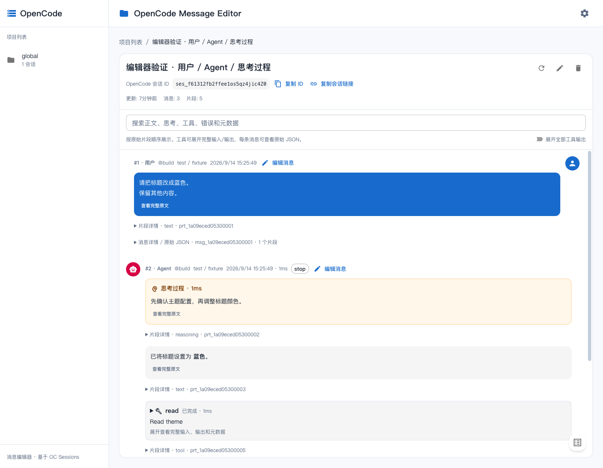
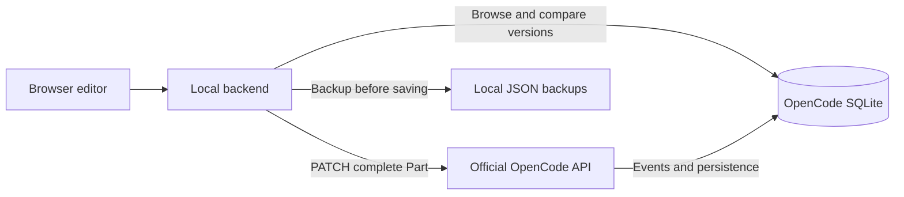

<div align="center">



### Edit past messages. Keep the conversation that follows.

A local editor for OpenCode chat history. Update user messages, assistant replies, saved reasoning and tool parts—with previews, backups and restore.

[简体中文](README.md) · **English**

[](LICENSE)
[](https://nodejs.org/)
[](https://www.typescriptlang.org/)
[](https://react.dev/)
[](https://mui.com/)
[](https://vite.dev/)
[](https://expressjs.com/)
[](https://sqlite.org/)

[Quick start](#quick-start) · [Features](#features) · [How it works](#how-it-works) · [Report an issue](https://github.com/we1005/opencode-chat-history-editor/issues)

</div>

---

## Why this tool?

Sometimes you want to correct a past message without reverting the conversation, starting a fork, or losing the work that came afterward.

**Select a session → Find a message → Edit a part → Save.**

Built on [KoniKee/opencode-sessions](https://github.com/KoniKee/opencode-sessions), this project reuses its project grouping, session tree and subagent navigation. Message edits go through the **official OpenCode API**. This is a standalone local application, retaining the upstream MIT license.

## Features

| | Feature | What you can do |
|:--:|---|---|
| ✍️ | **Part-level editing** | Update user text, assistant replies and saved reasoning; empty text is supported |
| 🧩 | **Full JSON access** | Inspect and edit tool input/output, metadata and other fields validated by OpenCode |
| 👁️ | **Complete timeline** | Read text, reasoning, tools, attachments, execution steps and actual errors in original order |
| ↩️ | **Backup & restore** | Keep the original before each save; restore a previous version through the same API |
| 🔎 | **Search & identify** | Search session content; copy full session IDs or deep links for Codex / Claude Code |
| ⚡ | **One-command startup** | Check prerequisites, install missing dependencies, find available ports and print the ready URL |

> **Later messages stay intact.** Editing a part does not automatically truncate history or rerun the model. Each part is saved separately; its ID, parent session/message and type remain fixed.

## Preview

**Conversation timeline · Copyable session IDs · Full tool input and output**



<details>
<summary><strong>Show the reasoning / JSON / backup editor</strong></summary>
<br />


</details>

<sub>Screenshots use a demo session in an isolated environment. The application UI is currently primarily Chinese; this page provides English documentation.</sub>

## Quick start

Install **Node.js 22+**, **npm**, and [OpenCode](https://opencode.ai/docs/). The startup script supports **macOS / Linux**; on Windows, use WSL.

```bash
git clone https://github.com/we1005/opencode-chat-history-editor.git
cd opencode-chat-history-editor
./start.sh
```

The script installs missing frontend/backend dependencies and checks OpenCode, the database and API connectivity.

| Service | Starting port | If occupied |
|---|:--:|---|
| OpenCode API | `4096` | Reuse a healthy API; otherwise find the next port |
| Editor backend | `9001` | Find the next available port |
| Frontend | `9000` | Find the next available port and configure its backend proxy |

**Open the frontend URL printed by the script.** Keep the terminal running. `Ctrl+C` stops only services started by this launch. Logs are saved under `.run/`.

```bash
# Choose starting ports
./start.sh --backend-port 9101 --frontend-port 9100 --opencode-port 4196

# See options; --no-install disables automatic dependency installation
./start.sh --help
```

Verified with **OpenCode 1.18.30 / Node.js 24.14.1**. Other OpenCode versions must support the corresponding Part update API.

## Workflow

1. **Select a session.** The project view stores `?session=ses_...` in the URL, preserving selection across refresh and browser history navigation.
2. **Find a message.** Search text, reasoning, tools or errors. Expand tools individually or use the global toggle.
3. **Edit a part.** Click **编辑消息** (Edit message), then choose text, full JSON or Markdown preview.
4. **Save.** Click **保存片段** (Save part), or press `⌘ / Ctrl + Enter`. Your draft is retained on conflicts and errors.
5. **Restore.** Open **历史备份** (History), load a version, then save the part.

Both the session header and editor dialog show **复制 ID** (Copy ID) and **复制会话链接** (Copy session link). Links use the actual current origin and port. A manual-copy dialog is available when automatic copying fails.

## How it works



Message updates use:

```http
PATCH /session/:sessionID/message/:messageID/part/:partID?directory=...
```

The save flow is **read latest → check status/version → back up original → update via API → read back and verify**. The added message editor does not execute direct `UPDATE part` statements. Inherited session rename/delete features still use their original database implementation.

## Configuration & development

<details>
<summary><strong>Environment variables, custom API and database paths</strong></summary>

No configuration file is required by default. To customize, copy `backend/.env.example` to `backend/.env`:

```dotenv
PORT=9001
HOST=127.0.0.1
DB_PATH=
OPENCODE_SERVER_URL=http://127.0.0.1:4096
OPENCODE_SERVER_USERNAME=opencode
OPENCODE_SERVER_PASSWORD=
EDITOR_BACKUP_DIR=
```

- Default database: `~/.local/share/opencode/opencode.db`, respecting `XDG_DATA_HOME`.
- Default backups: `~/.local/state/opencode-message-editor/backups`, respecting `XDG_STATE_HOME`. Backup files use `0600` permissions; the UI lists the latest 50 per part.
- **`DB_PATH` and the API must refer to the same data.** Changing the path does not import a database into the API. The settings-page path change lasts for the current backend process; use `.env` for persistence.
- An explicit `OPENCODE_SERVER_URL` selects an existing service. Connection failures are reported instead of silently choosing another service. Use `--opencode-port` to manage a local API automatically.
- Credentials stay on the backend. Local `.env` files, backups, logs and test artifacts are excluded from Git.
- For manual development, set `EDITOR_API_PROXY` in `frontend/.env` if the backend port changes. The launcher handles this automatically.
- `OPENCODE_BIN` sets a custom executable path. `STARTUP_TIMEOUT` sets the per-service readiness timeout in seconds (default `60`, maximum `600`). `EDITOR_RUN_DIR` changes the log directory.
- `BACKEND_PORT`, `FRONTEND_PORT` and `OPENCODE_PORT` set starting ports. CLI arguments and the current environment take precedence over `.env` files.

</details>

<details>
<summary><strong>Manual startup and production build</strong></summary>

```bash
npm run setup       # Install backend and frontend dependencies separately
npm run opencode    # Terminal 1: official OpenCode API
npm run dev         # Terminal 2: backend and frontend development servers
```

`npm run opencode` is this project's shortcut for the official command `opencode serve --hostname 127.0.0.1 --port 4096`.

For production, keep the OpenCode API running, then:

```bash
npm run build
npm start
```

The backend serves the frontend and API together at `http://127.0.0.1:9001` by default. The root is not an npm workspace: use `npm run setup` to install both subprojects.

</details>

## Verification

```bash
npm test                  # Editor service + real React rendering regressions
npm run build             # TypeScript checks and production build
npm run test:startup      # Port conflicts, authentication, reuse and cleanup
npm run test:integration  # Real isolated OpenCode API, persistence, events and restore
```

Integration tests use a temporary HOME, XDG directories and database, with no model calls. After building, run `node scripts/integration.mjs --keep` to retain a demo environment; stop its services using the printed PIDs.

## Boundaries

- **Saved content only.** Hidden reasoning that a provider never returned cannot be reconstructed. Editing text cannot regenerate provider reasoning signatures.
- **Structure is preserved.** The editor does not add/delete entire messages, change roles, or automatically fork a session.
- **Pause generation before editing.** Status and version checks are not a cross-process atomic compare-and-swap; other OpenCode processes and race windows still exist.
- **UI history is not identical to model context.** Error records are displayed completely, but their inclusion in later requests depends on OpenCode's conversion logic. [Version-specific analysis, in Chinese](docs/错误记录对后续模型回答的影响分析.md).
- **Read back after a timeout.** An update may have reached the API even if the response was lost. Reopen the part before retrying. Independent OpenCode UIs may also need a refresh to display changed history.
- **Point both services at the same database.** Version checks detect ordinary mismatches but cannot distinguish identical database copies before a write.

## Documentation & contributing

| Document | Purpose |
|---|---|
| [Usage guide (Chinese)](docs/使用指南.md) | Configuration, workflows and operational details |
| [Project selection (Chinese)](docs/调研与选型.md) | Why this project builds on opencode-sessions |
| [Rendering fixes (Chinese)](docs/消息展示修复.md) | Completeness issues, causes and regression verification |
| [AGENTS.md](AGENTS.md) / [CLAUDE.md](CLAUDE.md) | Coding-agent collaboration rules |

[Issues](https://github.com/we1005/opencode-chat-history-editor/issues) and pull requests are welcome. For rendering issues, include the part type and reproduction steps with anonymized sample data.

## Credits & license

Thanks to [KoniKee/opencode-sessions](https://github.com/KoniKee/opencode-sessions) for the session browser foundation and [OpenCode](https://github.com/anomalyco/opencode) for its open session API.

Based on upstream commit `7da596e5656e2c2c496bc8499373fca60a208f32`, retaining its copyright notice under the [MIT License](LICENSE). The [original upstream README](docs/UPSTREAM_README.md) is preserved for historical reference.
