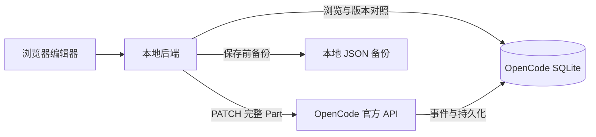

<div align="center">


### 原地编辑历史，保留完整的后续对话。

一个本地运行的 OpenCode 对话编辑器。修改用户消息、Agent 回复、已保存的思考过程和工具片段，支持预览、备份与恢复。

**简体中文** · [English](README.en.md)

[](LICENSE)
[](https://nodejs.org/)
[](https://www.typescriptlang.org/)
[](https://react.dev/)
[](https://mui.com/)
[](https://vite.dev/)
[](https://expressjs.com/)
[](https://sqlite.org/)

[快速开始](#快速开始) · [功能一览](#功能一览) · [工作原理](#工作原理) · [详细指南](docs/使用指南.md) · [反馈问题](https://github.com/we1005/opencode-chat-history-editor/issues)

</div>

---

## 为什么做这个工具

有时你只是想修正历史中的一段话，而不是回退整个会话、创建分支，或者丢掉后续的工作。

**选择会话 → 找到消息 → 编辑片段 → 保存。**

本项目基于 [KoniKee/opencode-sessions](https://github.com/KoniKee/opencode-sessions) 改造，复用项目分组、会话树和子 Agent 导航，通过 **OpenCode 官方 API** 写回消息。它是独立的本地应用，保留上游 MIT 许可证。

## 功能一览

| | 功能 | 你可以做什么 |
|:--:|---|---|
| ✍️ | **逐片段编辑** | 修改用户正文、Agent 回复、已保存的 reasoning；允许空文本 |
| 🧩 | **完整 JSON** | 查看和编辑工具输入 / 输出、metadata 等字段，由 OpenCode 校验结构 |
| 👁️ | **完整时间线** | 按原始顺序展示正文、思考、工具、附件、执行步骤和实际错误 |
| ↩️ | **备份与恢复** | 每次保存前备份原文，载入历史版本并通过同一 API 恢复 |
| 🔎 | **搜索与定位** | 搜索会话内容；复制完整会话 ID 或直达链接给 Codex / Claude Code |
| ⚡ | **一键启动** | 检查环境和依赖，端口占用自动顺延，确认就绪后输出前端 URL |

> **保留后续消息。** 编辑已有片段不会自动截断历史或重跑模型。每个片段单独保存；ID、所属会话 / 消息和片段类型保持固定。

## 界面预览

**完整会话时间线 · 可复制 ID · 工具输入与输出**


<details>
<summary><strong>展开查看：思考过程编辑 / JSON / 历史备份</strong></summary>
<br />


</details>

<sub>截图来自隔离环境中的演示会话。</sub>

## 快速开始

准备好 **Node.js 22+**、**npm** 和 [OpenCode](https://opencode.ai/docs/)。一键脚本支持 **macOS / Linux**，Windows 可使用 WSL。

```bash
git clone https://github.com/we1005/opencode-chat-history-editor.git
cd opencode-chat-history-editor
./start.sh
```

脚本会自动安装缺少的前后端依赖，并检查 OpenCode、数据库与 API 连接。

| 服务 | 起始端口 | 占用时 |
|---|:--:|---|
| OpenCode API | `4096` | 复用健康服务；其他程序占用则寻找下一端口 |
| 编辑器后端 | `9001` | 自动递增寻找可用端口 |
| 前端页面 | `9000` | 自动递增，并同步后端代理地址 |

**以终端最终输出的前端 URL 为准。** 保持终端运行，按 `Ctrl+C` 停止本次启动的服务。日志保存在 `.run/`。

```bash
# 指定起始端口
./start.sh --backend-port 9101 --frontend-port 9100 --opencode-port 4196

# 查看选项；也可用 --no-install 禁止自动安装依赖
./start.sh --help
```

已验证环境：**OpenCode 1.18.30 / Node.js 24.14.1**。其他 OpenCode 版本需支持对应的 Part 更新 API。

## 怎么使用

1. **选会话**：进入项目，选择要编辑的对话。地址栏记录 `?session=ses_...`，刷新和前进 / 后退会恢复选择。
2. **找消息**：搜索正文、思考、工具或错误；工具可单独展开，也可使用“展开全部工具输出”。
3. **编辑片段**：点击“编辑消息”，在文本、完整 JSON 和 Markdown 预览之间切换。
4. **保存**：点击“保存片段”，或按 `⌘ / Ctrl + Enter`。冲突或失败时保留草稿。
5. **恢复**：打开“历史备份”→“载入此版本”→“保存片段”。

会话标题下和编辑窗口内均提供 **复制 ID**、**复制会话链接**。链接使用当前页面的实际端口；自动复制不可用时提供手动复制窗口。

## 工作原理



消息编辑使用官方端点：

```http
PATCH /session/:sessionID/message/:messageID/part/:partID?directory=...
```

保存流程为 **读取最新版本 → 检查状态与版本 → 备份原文 → API 更新 → 重新读取核对**。新增消息编辑代码不直接执行 `UPDATE part`；上游会话重命名 / 删除功能仍沿用其数据库实现。

## 配置与开发

<details>
<summary><strong>环境变量、自定义 API 和数据库路径</strong></summary>

默认无需配置文件。自定义时复制 `backend/.env.example` 为 `backend/.env`：

```dotenv
PORT=9001
HOST=127.0.0.1
DB_PATH=
OPENCODE_SERVER_URL=http://127.0.0.1:4096
OPENCODE_SERVER_USERNAME=opencode
OPENCODE_SERVER_PASSWORD=
EDITOR_BACKUP_DIR=
```

- 默认数据库：`~/.local/share/opencode/opencode.db`，支持 `XDG_DATA_HOME`。
- 默认备份：`~/.local/state/opencode-message-editor/backups`，支持 `XDG_STATE_HOME`；文件权限为 `0600`。
- **`DB_PATH` 与 API 必须对应同一份数据。** 改数据库路径不会把该文件导入 API。
- 显式 `OPENCODE_SERVER_URL` 表示指定已有服务；连接失败会报错。用 `--opencode-port` 可改为自动管理本地 API。
- 密码只在后端使用。`.env`、备份、运行日志和本地验证产物不纳入 Git。
- 手动开发时更改后端端口，需在 `frontend/.env` 设置 `EDITOR_API_PROXY`；一键脚本会自动处理。
- 启动器另支持 `OPENCODE_BIN`、`STARTUP_TIMEOUT` 和 `EDITOR_RUN_DIR`，详见 [使用指南](docs/使用指南.md)。

</details>

<details>
<summary><strong>手动启动与生产构建</strong></summary>

```bash
npm run setup       # 分别安装 backend / frontend 依赖
npm run opencode    # 终端一：官方 OpenCode API
npm run dev         # 终端二：前后端开发服务
```

`npm run opencode` 是本项目定义的快捷命令，实际执行 `opencode serve --hostname 127.0.0.1 --port 4096`。

生产模式：先启动 OpenCode API，再执行：

```bash
npm run build
npm start
```

后端默认在 `http://127.0.0.1:9001` 同时提供静态页面与 API。根目录不是 npm workspace，安装依赖请使用 `npm run setup`。

</details>

## 验证

```bash
npm test                  # 编辑服务 + 真实组件渲染回归测试
npm run build             # TypeScript + 生产构建
npm run test:startup      # 端口冲突、认证、复用与退出清理
npm run test:integration  # 隔离的真实 OpenCode API 写回、事件、备份与恢复
```

集成测试使用临时 HOME / XDG / 数据库，不调用模型。需要保留演示环境时，构建后运行 `node scripts/integration.mjs --keep`，按输出的 PID 清理测试服务。

## 使用边界

- **编辑已保存的内容**：无法还原供应商没有返回的隐藏思考；修改文本不能重签供应商的 reasoning 签名。
- **保留数据结构**：当前不新增 / 删除整条消息，不改变角色，也不自动 fork 会话。
- **编辑前停止目标会话生成**：状态与版本检查不是跨进程原子 CAS，不能消除所有并发窗口。
- **界面不等于模型上下文**：错误记录会完整展示，但是否进入下一次模型请求取决于 OpenCode 的转换逻辑。[查看分析](docs/错误记录对后续模型回答的影响分析.md)。

更多配置、恢复语义和已知限制见 [完整使用指南](docs/使用指南.md)。

## 文档与贡献

| 文档 | 内容 |
|---|---|
| [使用指南](docs/使用指南.md) | 配置、运行方式、编辑语义和故障排查 |
| [调研与选型](docs/调研与选型.md) | 为什么基于 opencode-sessions 改造 |
| [消息展示修复](docs/消息展示修复.md) | 完整性问题、原因与回归验收 |
| [AGENTS.md](AGENTS.md) / [CLAUDE.md](CLAUDE.md) | 编码代理协作约定 |

欢迎提交 [Issue](https://github.com/we1005/opencode-chat-history-editor/issues) 或 Pull Request。展示问题请描述片段类型和复现步骤；示例数据请使用匿名内容。

## 致谢与许可证

感谢 [KoniKee/opencode-sessions](https://github.com/KoniKee/opencode-sessions) 提供会话浏览基础，感谢 [OpenCode](https://github.com/anomalyco/opencode) 提供开放的会话 API。

基于上游提交 `7da596e5656e2c2c496bc8499373fca60a208f32` 改造，保留原始版权声明，使用 [MIT License](LICENSE)。[上游原 README](docs/UPSTREAM_README.md) 作为历史参考保留。
