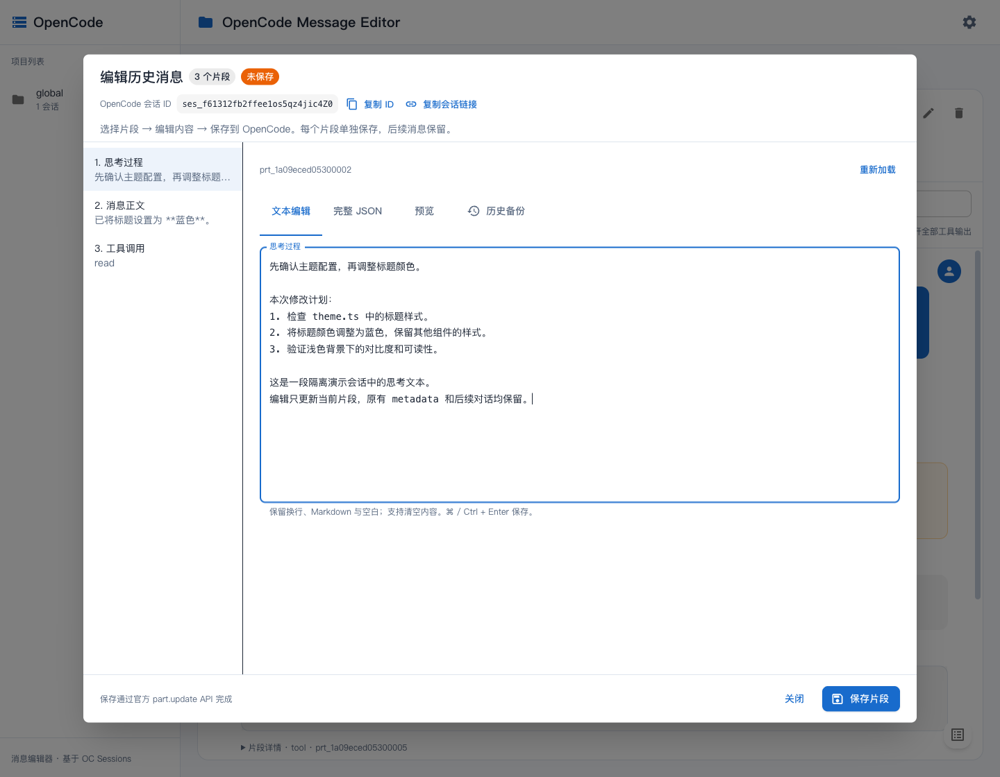

# 使用指南

**原地编辑 OpenCode 历史对话中的用户消息、Agent 回复、思考过程，以及工具等片段的完整 JSON。**

基于 [KoniKee/opencode-sessions](https://github.com/KoniKee/opencode-sessions) 改造，保留项目分组、会话树、子 Agent 跳转、Markdown 和工具展示。返回 [项目首页](../README.md) · [English](../README.en.md)。



## 已实现

- 选择会话，在任意一条消息旁点击 **编辑消息**。
- 一条消息有多个 part 时，分别选择正文、思考过程、工具调用或其他片段。
- 正文 / reasoning 支持多行文本、Markdown 预览、空字符串和完整 JSON 编辑。
- 完整 JSON 可修改工具输入 / 输出、metadata 等；由 OpenCode 校验结构。片段的 ID、所属消息、所属会话及类型固定。
- **保存调用 OpenCode `part.update` API**，保留后续历史，不重跑模型。
- 保存前自动备份原文；在 **历史备份 → 载入此版本 → 保存片段** 恢复。
- 内容版本冲突、API 报错时保留草稿；切换片段 / 关闭时提示未保存修改。
- 会话内全文搜索；支持 `⌘ / Ctrl + Enter` 保存。
- 会话标题下方和消息编辑弹窗内均显示完整 OpenCode `ses_...` ID，可一键复制 ID 或直达链接，方便交给 Codex / Claude Code 定位。
- 项目列表中选中会话后，地址栏会保存 `?session=ses_...`；刷新页面、浏览器前进 / 后退或打开相同 URL 时恢复相应选择。

### 如何把当前会话交给 Codex / Claude Code 查看

选中会话后，在右侧标题下点击 **复制 ID**，把该 ID 发给对方即可，例如：

```text
请检查 OpenCode 会话 ses_... 中我修改的消息。
```

**复制会话链接** 会复制当前编辑器地址下的 `/sessions/ses_...` 直达链接，使用实际端口。ID 会完整显示，也可手动选中复制；自动复制不可用时会弹出手动复制窗口。会话 ID 用于定位你本机的记录，其他机器上的 Agent 仍需能访问对应数据库或 OpenCode 服务。

### 完整消息展示

- 按原始 part 顺序展示正文、思考过程、工具、附件和执行步骤，不再按类型合并打乱顺序。
- 只有工具调用的助手消息正常显示工具卡片，不推断为“无响应”或“用户终止”。
- `message.error` 展示实际错误名称、完整消息、响应体及原始 JSON；已有部分正文时仍同时展示错误。
- 空 reasoning 片段显示已记录的耗时，明确标记“未保存思考文本”，保留元数据入口。
- 点击工具卡片查看完整输入 / 输出；顶部 **展开全部工具输出** 可一次展开。长内容在区域内滚动，不截成 2,000 字预览。
- 每个片段和每条消息都有原始 JSON 查看入口；正文可切换 **查看完整原文**。
- 显示模型 / 供应商、结束原因、耗时以及输入、输出、推理、缓存 token 明细。

错误是消息元数据，原文来自 `message.error`，不伪造为可编辑的正文 part。展示修复与验收记录见 [消息展示修复](消息展示修复.md)。

## 快速运行

要求：Node.js **22+**、npm、支持 `part.update` 的 OpenCode。已用 **OpenCode 1.18.30 / Node 24.14.1** 验证。

### 一键检查与启动（推荐）

```bash
./start.sh
```

也可从任意目录执行 `sh /path/to/opencode-chat-history-editor/start.sh`。

脚本会：

1. 检查 Node.js 版本、npm 和 OpenCode 可执行文件；缺少工具时给出明确提示。
2. 检查前后端依赖，缺失时自动运行 `npm ci`，并检查 SQLite 原生模块能否加载。
3. 默认检查 `4096` 端口：健康的 OpenCode API 直接复用；被其他程序占用则逐个尝试下一个端口并启动 API。
4. 从 `9001` 查找后端可用端口，从 `9000` 查找前端可用端口；端口冲突自动顺延，也处理两者指定为相同端口的情况。
5. 自动把最终 OpenCode 地址传给后端，把最终后端地址传给前端代理。
6. 检查数据库连接、前端页面及“前端 → 后端 → OpenCode”链路，成功后才打印 **前端 URL**。
7. 启动失败、子服务意外退出或按 Ctrl+C 时回收本次启动的服务；复用的已有 OpenCode 服务不由脚本停止。

脚本在前台运行，请保持终端打开。每次运行的日志位于 `.run/时间戳-PID/`；不会修改 `.env` 中保存的配置。

自定义起始端口：

```bash
./start.sh --backend-port 9101 --frontend-port 9100 --opencode-port 4196
./start.sh --no-install # 依赖不齐时直接提示，不自动安装
./start.sh --help
```

也支持 `BACKEND_PORT`、`FRONTEND_PORT`、`OPENCODE_PORT` 环境变量。默认读取 `backend/.env` 和前端 Vite 的 `.env` 文件；命令行、当前环境变量优先。自定义 OpenCode 安装位置可设置 `OPENCODE_BIN=/绝对路径/opencode`。

如果配置了 **`OPENCODE_SERVER_URL`**，脚本将它视为指定的已有服务，连接失败时报告错误，不悄悄换到另一份服务；可用 `--opencode-port` 改为由脚本启动本地 API。认证信息使用 `OPENCODE_SERVER_USERNAME` / `OPENCODE_SERVER_PASSWORD`。401 / 403 会直接提示检查凭据。

默认每个服务等待就绪最多 60 秒；较慢机器可设置 `STARTUP_TIMEOUT=120`。日志位置可通过 `EDITOR_RUN_DIR` 修改。

### 手动分开启动

```bash
cd opencode-chat-history-editor
npm run setup
```

**终端一：启动 OpenCode API**（已在 4096 端口运行时可复用）：

```bash
npm run opencode
```

**终端二：启动编辑器**：

```bash
npm run dev
```

打开 **http://127.0.0.1:9000**。进入项目 → 会话 → 点击 **编辑消息**。

默认读取 `~/.local/share/opencode/opencode.db`，也支持 `XDG_DATA_HOME`。设置页可查看数据库与 API 连接状态。开发后端在 `127.0.0.1:9001`。

### `npm run opencode` 是谁提供的命令？

**`npm run opencode` 是本项目添加的 npm 快捷命令，底层调用的是 OpenCode 自带的 `opencode serve`。**

它在 [package.json](../package.json) 的 `scripts` 中定义：

```json
"opencode": "opencode serve --hostname 127.0.0.1 --port 4096"
```

因此，在本项目目录执行 `npm run opencode`，等价于直接执行：

```bash
opencode serve --hostname 127.0.0.1 --port 4096
```

`opencode serve` 是 OpenCode 官方命令，会启动一个不带终端聊天界面的 HTTP API 服务，监听本机的 `4096` 端口。编辑器通过这个服务获取待编辑的消息片段，并调用官方 API 保存修改。

本项目只提供启动快捷方式，没有自行实现或修改 OpenCode 服务端；运行时使用你已经安装的 `opencode` 可执行文件。如果已有可用的 OpenCode API 服务，可以在 `backend/.env` 中设置 `OPENCODE_SERVER_URL` 连接它，无需重复启动。该服务需要与编辑器浏览的数据库对应。

### 自定义配置

默认无需配置文件。需要自定义时，将 `backend/.env.example` 复制为 `backend/.env` 后配置，修改环境变量后重启后端：

```dotenv
PORT=9001
HOST=127.0.0.1
DB_PATH=/absolute/path/to/opencode.db
OPENCODE_SERVER_URL=http://127.0.0.1:4096
OPENCODE_SERVER_USERNAME=opencode
OPENCODE_SERVER_PASSWORD=
EDITOR_BACKUP_DIR=
```

`DB_PATH` 必须与 API 使用同一份 OpenCode 数据库；它不是把数据库导入 API 的选项。若修改了 OpenCode 数据目录，也要用相同的 `XDG_DATA_HOME` 启动 API。设置页切换数据库路径只影响当前后端进程，持久配置请写入 `.env`。

密码在后端使用，不传给前端。备份默认存放在 `~/.local/state/opencode-message-editor/backups`（或 `XDG_STATE_HOME` 下），每个备份保存修改前后完整 part，文件权限为 `0600`。界面显示最近 50 个备份，磁盘文件不自动清理。

后端换端口时，将 `frontend/.env.example` 复制为 `frontend/.env`，设置 `EDITOR_API_PROXY=http://127.0.0.1:新端口`。`VITE_API_BASE=/api` 保持同源。`.env` 文件已加入 Git 忽略列表。

### 生产方式

```bash
npm run build
npm start
```

打开 **http://127.0.0.1:9001**。后端同时提供前端静态页面和 API；OpenCode API 仍需运行。

## 编辑语义

1. 编辑对象是 OpenCode 已持久化的 `part`；用户与助手角色保存在所属 `message` 上。
2. 文本编辑只改 `text`，保留原有时间、metadata、工具关联等；高级 JSON 模式允许手动改其他字段。
3. 每次只保存一个片段。备份恢复也是一次正常 API 更新，并再次备份当前版本。
4. 保存走 OpenCode 自身的事件 / 持久化流程。数据库用于浏览和编辑前对照；**新增消息编辑代码没有直接执行 `UPDATE part`**。上游已有的会话重命名 / 删除功能仍沿用上游实现。
5. 当前版本不新增 / 删除整条消息，不改变消息角色，也不自动 fork 或截断后续对话。

### 已知边界

- 只能编辑实际保存出来的 reasoning 文本。供应商未返回或仅提供加密数据的内容无法还原。修改显示文本也不等于能重签供应商的 reasoning 签名；带签名 / 加密 metadata 的历史在后续请求中是否被模型接受，取决于供应商。
- 服务会阻止**连接到的 API 实例**中正在生成的会话，并在保存前比较版本。官方 PATCH 没有原子 `If-Match`：另一个独立 OpenCode 进程的状态不可见，检查与写入之间也存在短暂窗口。编辑时先让目标会话停止生成。
- 如果独立 TUI / 桌面进程仍显示缓存，重新进入或刷新会话后查看；当前编辑器保存后会自动刷新消息。
- JSON 必须满足当前 OpenCode 的 Part schema。超时后先重新加载核对结果，再重试；原文在调用 PATCH 前已备份。
- 浏览数据库和 API 需属于同一份数据。版本比较能发现通常的数据不一致，但无法在写入前区分两份内容完全相同的数据库副本。

## 验证

```bash
npm test                  # 7 个服务级测试 + 6 个真实组件渲染回归测试
npm test --prefix frontend # 单独验证完整消息展示
npm run test:startup       # 隔离环境验证一键启动、端口顺延、API 复用及退出清理
npm run test:integration  # 构建并启动隔离的真实 OpenCode API
```

集成测试使用新建临时 HOME / XDG 目录和数据库，不访问真实历史，不调用模型。测试通过 API 创建会话，用 SQL 写入**测试专用**的已完成消息，再经编辑器 API 验证：

- 用户正文、Agent 正文、reasoning、工具 JSON 修改；
- metadata 保留、SQLite 写回、409 冲突、备份及恢复；
- 消息表与后续消息保持原样，OpenCode 更新事件正确持久化。

可保留测试服务用于浏览器验收：

```bash
npm run build
node scripts/integration.mjs --keep
```

输出页面地址、临时目录和服务 PID，并写入 `.editor-test/connection.json`。结束后按输出的 PID 停止两个测试服务。可用 `OPENCODE_BIN` 指定可执行文件；默认从 `PATH` 查找 `opencode`。

## 代码位置

编码代理协作约定见 [AGENTS.md](../AGENTS.md)；Claude Code 通过 [CLAUDE.md](../CLAUDE.md) 导入相同约定。

| 文件 | 用途 |
|---|---|
| `frontend/src/components/SessionDetail/MessageEditorDialog.tsx` | 逐片段文本 / JSON / 预览 / 备份编辑器 |
| `frontend/src/components/SessionDetail/MessageItem.tsx` | 消息身份、模型、耗时、token 与编辑入口 |
| `frontend/src/components/SessionDetail/MessageContent.tsx` | 按序展示所有片段、真实错误、工具完整输入 / 输出 |
| `backend/src/routes/editor.ts` | 片段定位、数据库版本对照、编辑 API |
| `backend/src/services/partEditor.ts` | 官方 API、版本检查、备份、写回核对 |
| `backend/test/partEditor.test.cjs` | 冲突、原文保留、错误与恢复测试 |
| `scripts/integration.mjs` | 隔离 OpenCode 的真实集成验证 |

上游基线：`7da596e5656e2c2c496bc8499373fca60a208f32`。保留原 [MIT LICENSE](../LICENSE)；上游功能说明见 [原 README](UPSTREAM_README.md)。
